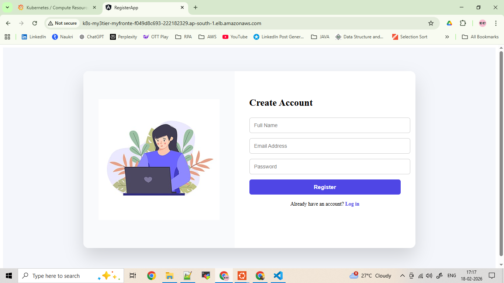
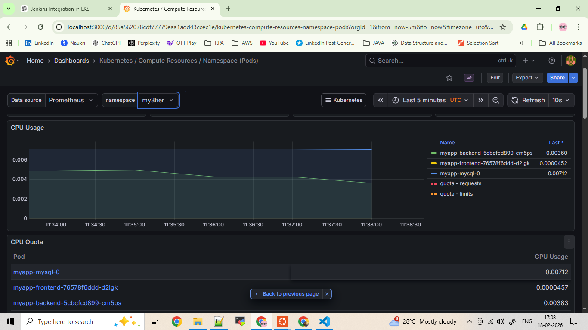
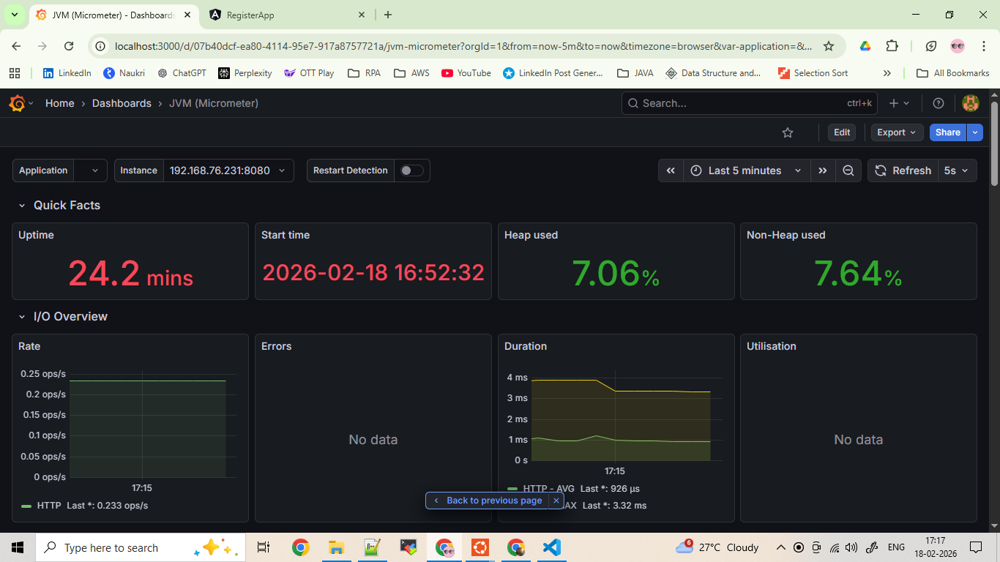

---


# 🚀 Full Stack 3-Tier Application Deployment on AWS EKS (With Stateful Database)

## 📌 Project Overview

This project demonstrates end-to-end deployment of a **containerized full stack 3-tier application** on **AWS Elastic Kubernetes Service (EKS)** using production-style cloud architecture.

The deployment includes:

* Containerized Frontend UI
* Backend API Service
* MySQL Database deployed using **StatefulSet + Persistent Volume (EBS)**

This project focuses on real-world cloud native practices like IAM integration, ALB ingress routing, persistent storage, and autoscaling worker nodes.

---

## 🏗️ Architecture

```
User → AWS ALB → Kubernetes Ingress → Services → Pods → MySQL (StatefulSet + PVC + EBS)
```

---

## 🛠️ Tech Stack

### ☁️ Cloud & AWS

* AWS EKS
* AWS ECR
* AWS Application Load Balancer (ALB)
* IAM Roles + OIDC Provider
* AWS EBS Storage

### ⚙️ DevOps & Infrastructure

* Docker
* Kubernetes
* Helm
* eksctl
* AWS Load Balancer Controller
* AWS EBS CSI Driver

### 💻 Application Layer

* Frontend: (Update — Angular)
* Backend: (Update —  Java)
* Database: MySQL (Stateful Deployment)

---

## 📦 Containerization

### Backend Image

* Built using Docker
* Tagged and pushed to AWS ECR repository:

```
register-backend
```

### Frontend Image

* Built and pushed to:

```
register-frontend
```

---

## 🗂️ AWS ECR Integration

Docker images stored securely in AWS ECR and used directly in Kubernetes deployment manifests.

---

## ⚙️ EKS Cluster Configuration

Cluster created using:

```
eksctl create cluster \
--name register-app-cluster \
--region ap-south-1 \
--version 1.33 \
--nodegroup-name register-app-ng \
--node-type t3.small \
--nodes 2 \
--nodes-min 1 \
--nodes-max 4
```

Features:

* Managed Node Group
* Auto Scaling Enabled

---

## 🔐 IAM & Security Configuration

Configured:

* IAM OIDC Provider for cluster
* IAM Role for AWS Load Balancer Controller
* IAM Role for AWS EBS CSI Driver

This enables secure communication between Kubernetes and AWS services.

---

## 🌐 Load Balancing & Ingress

Installed AWS Load Balancer Controller using Helm.

Features Implemented:

* Internet-Facing ALB
* IP Target Type
* Path-Based Routing

Routing Example:

| Path | Destination      |
| ---- | ---------------- |
| /    | Frontend Service |
| /api | Backend Service  |

---

## 💾 Stateful Database Deployment

### MySQL Deployment

* Deployed using Kubernetes StatefulSet
* Persistent storage using PVC
* Storage provisioned dynamically via AWS EBS CSI Driver

### Storage Flow

```
Pod → PVC → StorageClass → EBS Volume → AWS
```

### Benefits

* Data persistence across pod restarts
* Stable network identity
* Ordered pod startup

---

## 📊 Traffic Flow

1. User accesses ALB DNS
2. ALB forwards traffic to Kubernetes Ingress
3. Ingress routes traffic based on path
4. Services route traffic to correct pods
5. Backend connects to MySQL Stateful pod

---

## 🚀 Deployment Steps (High Level)

### 1️⃣ Build Docker Images

```
docker build -t frontend .
docker build -t backend .
```

---

### 2️⃣ Push Images to AWS ECR

```
aws ecr create-repository
docker tag <image>
docker push <ECR repo>
```

---

### 3️⃣ Create EKS Cluster

```
eksctl create cluster ...
```

---

### 4️⃣ Configure OIDC & IAM Roles

Required for:

* ALB Controller
* EBS CSI Driver

---

### 5️⃣ Install Controllers Using Helm

* AWS Load Balancer Controller
* EBS CSI Driver

---

### 6️⃣ Deploy Kubernetes Resources

```
kubectl apply -f mysql/
kubectl apply -f backend/
kubectl apply -f frontend/
kubectl apply -f ingress/
```
---

## 🤖 CI/CD Automation

This project includes a **Jenkins pipeline** that fully automates the deployment workflow for the 3-tier application:

### Pipeline Features

1. **Build Docker Images**

   * Frontend and backend images are automatically built using the source code from GitHub.
   * Each image is tagged with the Jenkins build number for traceability.

2. **Push to AWS ECR**

   * Images are pushed securely to AWS Elastic Container Registry (ECR) using IAM credentials.

3. **Deploy to AWS EKS**

   * The pipeline updates the Kubernetes deployments with the new images.
   * `kubectl rollout status` ensures pods are ready before the pipeline completes.
   * Supports automatic updates for both frontend and backend services.

4. **Rollback and Error Handling (..to be done)**

   * If a deployment fails, the pipeline can automatically rollback to the previous stable version.
   * Optional notifications can be integrated (Slack, email) for deployment success or failure.

---

### Benefits

* Fully automated deployment reduces human errors.
* Ensures consistent and repeatable deployments across environments.
* Tracks build numbers and image versions for auditability.
* Enables rapid updates to application services without downtime.

---

## 📊 Monitoring & Observability

Cluster and application monitoring implemented using:

* Prometheus — Metrics collection
* Grafana — Dashboard visualization
* Micrometer — Application JVM metrics exposure

### Monitoring Coverage

#### Kubernetes Level

* Node CPU / Memory usage
* Pod CPU / Memory usage
* Pod restart tracking
* Namespace resource consumption

#### Application Level (JVM Metrics)

* Heap Memory Usage
* Non-Heap Memory
* Garbage Collection Metrics
* Thread Count
* HTTP Request Metrics
* API Response Time

---

### 📈 Grafana Dashboards Used

* Kubernetes Namespace Pod Dashboard
* JVM Micrometer Dashboard

---

### ✅ Monitoring Outcome

* Real-time cluster health visibility
* Application performance monitoring
* JVM memory behaviour tracking
* Request latency monitoring

---

## 🧪 Testing & Validation

System validated by:

* Verifying Prometheus metric scraping
* Checking JVM metrics in Grafana dashboards
* Monitoring pod lifecycle behaviour
* Validating ingress routing via ALB

---

## 🧠 Production Considerations

* Stateful DB persistence using EBS volumes
* IAM role based secure AWS integration
* Auto scaling worker nodes
* External load balancing using ALB
* Observability ready monitoring stack

---

## 🚀 Real World Relevance

This architecture simulates production workloads by combining:

* Stateless frontend/backend services
* Stateful database persistence
* Cloud native ingress routing
* Centralized monitoring and observability
* Automated CI/CD deployment

---

## 📸 Proof of Deployment

### Application UI



### Grafana Kubernetes Metrics



### JVM Metrics Dashboard



---
## 🔗 Application Access

Frontend:

```
http://<ALB-DNS>
```

Backend API:

```
http://<ALB-DNS>/api/register
```

---

## 🔥 Challenges Faced & Solutions

### ❌ ALB Targets Showing Unhealthy

**Cause:** Incorrect health check path
**Fix:** Added ALB health check annotation

---

### ❌ Ingress Not Routing Properly

**Cause:** Service port mismatch
**Fix:** Correct Service Port → TargetPort mapping

---

### ❌ Storage Not Attaching Initially

**Cause:** Missing CSI Driver IAM role
**Fix:** Configured IAM + Reinstalled addon

---

## 📚 Key Learnings

* Stateful workloads inside Kubernetes
* AWS IAM + Kubernetes integration
* ALB based ingress routing in EKS
* Persistent storage using EBS volumes
* Real-world Kubernetes debugging

---

## 👩‍💻 Author

Jeeva Bharathi Aspiring DevOps / Cloud Engineer

---
